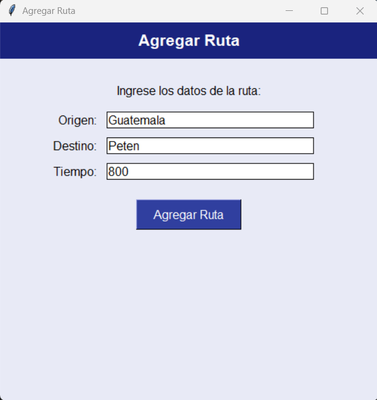

# Manua de Usuario
# LLega Rapidito - Sistema de Gestión

Bienvenido al sistema de gestión de Llega Rapidito, a continuación tienes el manual de uso del sistema de software.

## Menú principal

Al iniciar la aplicación, tendrás interacción con el menú, en este menú tendrás los diferentes módulos para gestionar clientes, vehículos, rutas y viajes (opción en desarrollo).


Podrás seleccionar cualquiera de estos módulos para realizar las diferentes gestiones.

### Módulo Clientes

Una vez ingresado al modulo de clientes, tendrás diferentes opciones para realizar las gestiones.


Puedes seleccionar cualquierda de ellas para realizar tus gestiones

- Opción Agregar

Esta opción desplegará una ventana en la cual podrás ingresar los datos de un cliente que desees agregar.


Una vez agregados todos los datos del cliente puedes presionar el botón Agregar Cliente y procederas a agregar al cliente a la estructura de datos Arbol AVL que el sistema utiliza para manejar los clientes.


En el caso de que falte algún campo por llenar, el sistema desplegara un mensaje de error indicando que se deben llenar todos los campos. 


- Opción Modificar

Esta opción te pedirá ingresar la llave (DPI) del cliente que deseas modificar.


Posterior a ingresar la llave, se desplegará una ventana en la cual podras modificar los datos del cliente.


Una vez modificados los datos del cliente, se mostrará un mensaje de confirmación indicando que los datos se han modificado correctamente, en el caso de que falte algún dato de mostrará un mensaje indicando que deben completarse todos los campos.

- Opción elimiminar

Esta opción también solicitará ingresar una llave para poder eliminar al cliente.

Una vez ingresada la llave, se mostrará un mensaje que solicitará una confirmación para eliminar al cliente.


Luego de confirmar que se desea eliminar al cliente, el sistema mostrará un mensaje indicando que se ha eliminado correctamente al cliente y eliminara de su estructura de datos al cliente sin que quedé ningún registro del mismo.

- Opción mostrar información

Esta opción también solicitirá ingresar una llave para mostrar la información del cliente.

Una vez ingresada la llave, se desplegará una ventana con toda la información del cliente, en el caso de que la llave sea erronea, se mostrará un mensaje de error indicando que no existe el cliente.


###### Prueba realizada previo a eliminar al cliente

En caso de ingresar un cliente con una llave erronea, el sistema mostrará un mensaje indicando que no se encontró ningún cliente con esa llave.


###### Prueba realizada posterior a eliminar al cliente

- Mostrar estructura de datos

Una vez seleccionada la opción de mostrar estructura de datos, el sistema procedera a generar un reporte gráfico de la estructura de datos Árbol AVL en la cual se almacenan todos los clientes y procederá a mostrarla.


##### Estructura de datos generada luego de realizar la carga masiva


- Carga masiva

Para realizar la carga masiva de clientes, como primer paso se necesita un archivo de texto (.txt) como el siguiente:


El archivo contiene los datos de un cliente con la siguiente estructura:

```
dpi, nombres, apellidos, género, teléfon, dirección;
```

En el caso de que alguna linea contenga algún error, el sistema lo detectará y omitirá la linea que contiene el error.

Luego, al seleccionar la opción de carga masiva, el sistema abrira el seleccionador de archivos para que puedas seleccionar el archivo para realizar la carga masiva.


Una vez seleccionado el archivo, el sistema mostrará un mensaje indicando que la carga masiva se ha completado y todos los clientes en el archivo se habrán añadido correctamente a la estructura de datos Árbol AVL.

### Módulo Vehículos

Una vez ingresado al modulo de vehículos, tendrás diferentes opciones para realizar las gestiones.


Puedes seleccionar cualquierda de ellas para realizar tus gestiones

- Opción Agregar

Esta opción desplegará una ventana en la cual podrás ingresar los datos de un vehículo que desees agregar.


Una vez agregados todos los datos del vehículo puedes presionar el botón Agregar Vehículo y procederas a agregar al vehículo a la estructura de datos Arbol B que el sistema utiliza para manejar los vehículos.


En el caso de que falte algún campo por llenar, el sistema desplegara un mensaje de error indicando que se deben llenar todos los campos. 


- Opción Modificar

Esta opción te pedirá ingresar la llave (Placa) del vehículo que deseas modificar.


Posterior a ingresar la llave, se desplegará una ventana en la cual podras modificar los datos del vehículo.


Una vez modificados los datos del vehículo, se mostrará un mensaje de confirmación indicando que los datos se han modificado correctamente, en el caso de que falte algún dato de mostrará un mensaje indicando que deben completarse todos los campos.

- Opción elimiminar

Esta opción también solicitará ingresar una llave para poder eliminar al vehículo.

Una vez ingresada la llave, se mostrará un mensaje que solicitará una confirmación para eliminar al vehículo.


Luego de confirmar que se desea eliminar al vehículo, el sistema mostrará un mensaje indicando que se ha eliminado correctamente al vehículo y eliminara de su estructura de datos al vehículo sin que quedé ningún registro del mismo.

- Opción mostrar información

Esta opción también solicitirá ingresar una llave para mostrar la información del vehículo.

Una vez ingresada la llave, se desplegará una ventana con toda la información del vehículo, en el caso de que la llave sea erronea, se mostrará un mensaje de error indicando que no existe el vehículo.


###### Prueba realizada previo a eliminar al vehículo

En caso de ingresar un vehículo con una llave erronea, el sistema mostrará un mensaje indicando que no se encontró ningún vehículo con esa llave.


###### Prueba realizada posterior a eliminar al vehículo

- Mostrar estructura de datos

Una vez seleccionada la opción de mostrar estructura de datos, el sistema procedera a generar un reporte gráfico de la estructura de datos Árbol B en la cual se almacenan todos los vehículos y procederá a mostrarla.


##### Estructura de datos generada luego de realizar la carga masiva

- Carga masiva

Para realizar la carga masiva de vehículos, como primer paso se necesita un archivo de texto (.txt) como el siguiente:


El archivo contiene los datos de un vehículo con la siguiente estructura:

```
placa:mara:modelo:precio;
```

En el caso de que alguna linea contenga algún error, el sistema lo detectará y omitirá la linea que contiene el error.

Luego, al seleccionar la opción de carga masiva, el sistema abrira el seleccionador de archivos para que puedas seleccionar el archivo para realizar la carga masiva.


Una vez seleccionado el archivo, el sistema mostrará un mensaje indicando que la carga masiva se ha completado y todos los vehículos en el archivo se habrán añadido correctamente a la estructura de datos Árbol B.

### Módulo Rutas

Una vez ingresado al modulo de rutas, tendrás diferentes opciones para realizar las gestiones.


Puedes seleccionar cualquierda de ellas para realizar tus gestiones

- Opción Agregar

Esta opción desplegará una ventana en la cual podrás ingresar los datos de una ruta que desees agregar.



Una vez agregados todos los datos de la ruta puedes presionar el botón Agregar Ruta y procederas a agregar a la ruta a la estructura de datos Grafo que el sistema utiliza para manejar las rutas.


En el caso de que falte algún campo por llenar, el sistema desplegara un mensaje de error indicando que se deben llenar todos los campos. 


- Mostrar estructura de datos

Una vez seleccionada la opción de mostrar estructura de datos, el sistema procedera a generar un reporte gráfico de la estructura de datos Grafo en la cual se almacenan todos las rutas y procederá a mostrarla.


##### Estructura de datos generada luego de realizar la carga masiva y de agregar un dato

- Carga masiva

Para realizar la carga masiva de rutas, como primer paso se necesita un archivo de texto (.txt) como el siguiente:


El archivo contiene los datos de una ruta con la siguiente estructura:

```
origen/destino/tiempo%
```

En el caso de que alguna linea contenga algún error, el sistema lo detectará y omitirá la linea que contiene el error.

Luego, al seleccionar la opción de carga masiva, el sistema abrira el seleccionador de archivos para que puedas seleccionar el archivo para realizar la carga masiva.


Una vez seleccionado el archivo, el sistema mostrará un mensaje indicando que la carga masiva se ha completado y todos las rutas en el archivo se habrán añadido correctamente a la estructura de datos Grafo.


